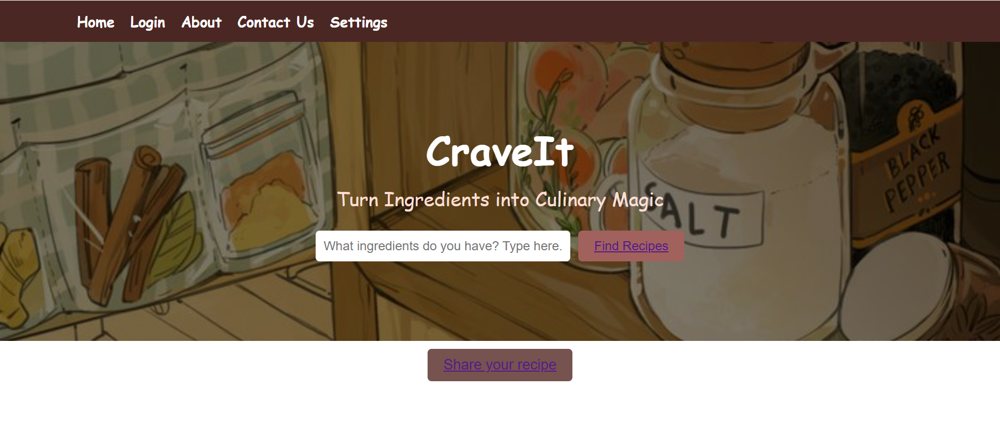

# Craveit

## Basic Details

### Team name: HAvoCK

#### Team members:
        Anna Angela Jacob - TKM College of Engineering
        Jesmi Jayan - TKM College of Engineering
        Jeena Grace Mathew - TKM College of Engineering

#### Hosted Project Link

#### Project Description

Craveit is a user-friendly recipe-sharing platform where users can discover, create, and customize recipes based on their dietary preferences, health considerations, and ingredient availability. The website offers features like personalized recommendations, ingredient substitutions, and a seamless recipe submission interface.

#### The Problem statement

Let’s face it: cooking can sometimes feel like an overwhelming game of Tetris with ingredients, dietary restrictions, and a bunch of recipes that don’t quite match what you’re craving. You might be stuck staring into your fridge trying to figure out how to make a meal with that random bunch of veggies and half a bag of rice. Or maybe you’ve got a specific diet in mind—gluten-free, keto, or vegan—but your recipe search ends up feeling like scrolling through a never-ending Pinterest board of things you can’t even eat. Plus, every time you find a new recipe, it’s hard to keep track of it and share it with friends. We get it—cooking can be stressful, but it should be fun, right?

#### The Solution

Welcome to CraveIt—the recipe platform that’s got your back in the kitchen (and your pantry)! Want to use up the ingredients you’ve got lying around? Just input them into our easy-to-use system, and boom—recipe suggestions that are tailored just for you. Whether you're looking for healthy meals, quick fixes, or dishes that meet your specific dietary needs (hello, gluten-free and keto), CraveIt makes sure you get exactly what you're after. Missing a few ingredients? No worries! We’ll throw out some tasty alternatives so you don’t have to make an extra trip to the store. Want to share your own recipes and meal ideas? We’ve got you covered there too! CraveIt lets you store, organize, and share your culinary creations, making cooking way more fun, easy, and totally personalized. Your next favorite meal is just a click away!

### Technical Details

#### Technologies/Components Used

For software:
  - Languages used: HTML, CSS, Javascript, Python
  - Libraries used: FastAPI, FastAPI Security, Pydantic, Typing, Passlib, Jose, Datetime, SQLAlchemy, SQLAlchemy ORM, Databases, Secrets, MySQL Connector
  - Tools used: Git (version control), GitHub (repository hosting), MySQL (database)

#### Implementation

The Recipe Finder website integrates MySQL, Python FastAPI, and HTML/CSS to provide a user-friendly platform for managing and discovering recipes. MySQL serves as the database, storing user details and recipe information in structured tables, including a users table for registration data and a recipes table for recipe submissions linked to users. The backend, developed using Python FastAPI, acts as the connection layer, providing endpoints for user registration, login, recipe addition, and search functionalities. FastAPI ensures secure operations through JWT authentication and simplifies database interactions using SQLAlchemy for ORM. The frontend, designed with HTML and CSS, offers an intuitive interface where users can register, log in, submit recipes, and search for them based on ingredients. JavaScript handles dynamic features like form submission and fetch requests to backend APIs, ensuring smooth communication between the frontend and backend.

#### Project Documentation

### Screenshots 
           

### Video

https://drive.google.com/file/d/1AT4Z8tboZ6t555Mwm_xiCvMOiA_wVcdy/view?usp=drive_link 

#### Team Contributions
        Anna Angela Jacob : Backend code
        Jesmi Jayan : Frontend Development
        Jeena Grace Mathew : Database Development

